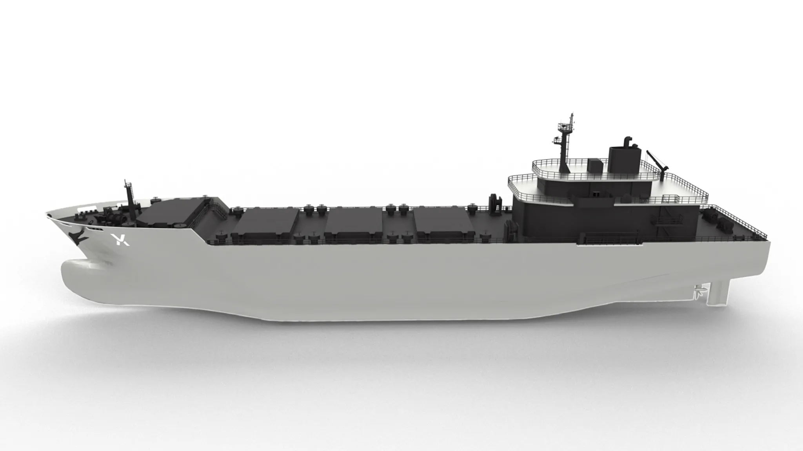
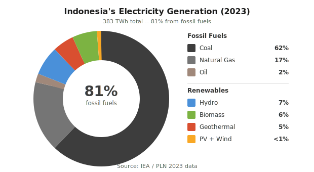
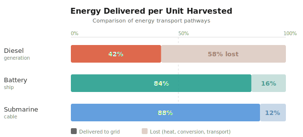
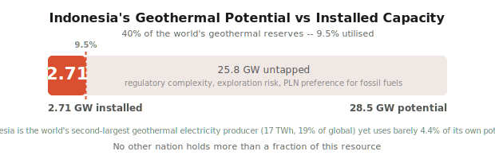
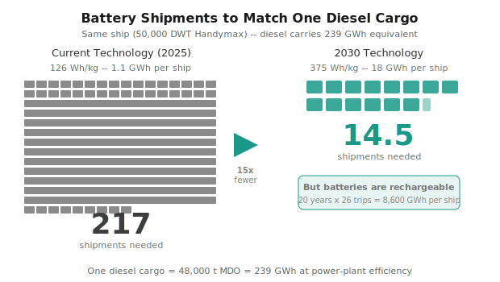
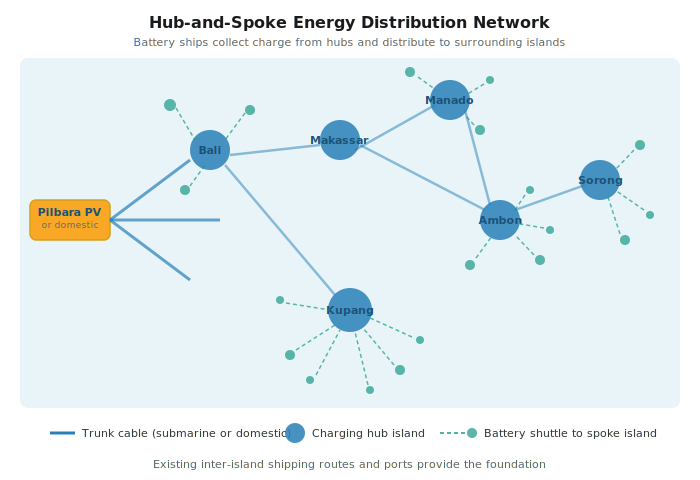
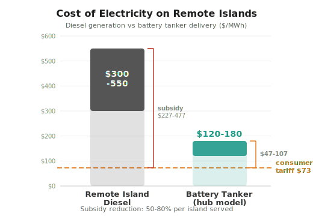
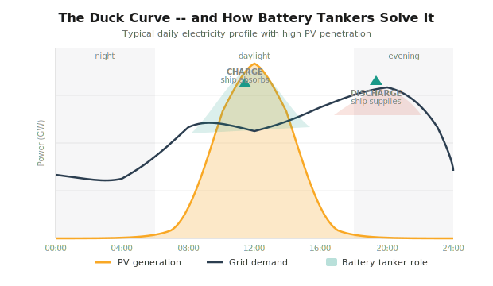
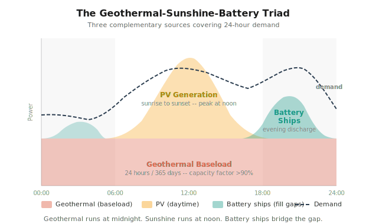

# Shipping Sunshine
## Battery Tankers, Floating Storage, and Indonesia's Renewable Energy Future

*On the viability of transporting electricity by sea, and what it means for the six thousand inhabited islands of Indonesia.*

> *A note on language: In Indonesian, the word "solar" means diesel fuel -- from the Pertamina brand name that has become the generic term for BBM diesel across the archipelago. In international usage, "solar" refers to energy from the sun. To avoid confusion, this paper uses "sunshine," "sun-powered," or "PV" (photovoltaic) when referring to energy from the sun, and "diesel" when referring to fossil fuel. In any Indonesian translation, sun-derived energy should be rendered as **tenaga surya** or **energi matahari**, and diesel fuel as **BBM diesel**.*

---

## The Paradox

Indonesia sits on the equator. It receives about 1,700 kilowatt-hours of radiant energy per square metre per year -- enough, in theory, to generate many times the nation's electricity needs from sunlight alone.

In practice, it burns coal.

In 2023, 81 per cent of Indonesia's 383 TWh of electricity generation came from fossil fuels. Coal alone accounted for 62 per cent. Natural gas, 17 per cent. Oil, 2 per cent. PV and wind together -- on the equator, in a country with one of the best sunshine endowments on Earth -- contributed less than 1 per cent.

Indonesia spent IDR 713.5 trillion on energy subsidies in 2024. Nearly ninety per cent of that went to fossil fuels. PLN operates more than 5,200 diesel power plants -- targeted for conversion under the national De-dieselisation Programme -- with a combined capacity of 2.6 gigawatts, most of them grinding away on remote islands where the cost of generation exceeds $300 per megawatt-hour -- more than four times the average tariff consumers pay. The government covers the difference. In 2025, the electricity subsidy alone ran to IDR 83 trillion. That is roughly $5.1 billion.

Meanwhile, the country imported 17.58 million tonnes of crude oil in 2025 at a cost of $8.3 billion. The oil-and-gas trade balance stayed stubbornly in deficit -- around $1.6 billion per month. Indonesia produces about half the oil it consumes. Coal is abundant domestically -- the country holds the world's seventh-largest reserves and was the world's largest coal exporter by weight in 2024 -- but coal-fired generation locks in carbon emissions for decades and faces growing international pressure. In 2025, coal production and exports declined for the first time in five years as Chinese and Indian demand weakened.

So here is the paradox: a nation awash in sunlight, sitting on world-class geothermal reserves, generating nearly two-thirds of its electricity from coal and paying billions more to burn imported diesel on its remotest islands.

In Indonesian, the word for diesel fuel is *solar*. This paper proposes, in the most literal sense, to give that word back to the sun.

The question is whether a novel approach -- transporting sun-generated electricity by ship, stored in batteries -- could offer Indonesia a practical path out of this paradox, particularly for the hundreds of remote islands that currently depend entirely on diesel.

---

## The Battery Tanker Concept

The idea is simpler than you might expect. A cargo ship is fitted with rechargeable battery packs. At a sunshine-powered port -- say, Port Hedland in Western Australia -- the batteries are charged to capacity. The ship sails to a destination city, plugs into the local electricity grid, discharges its cargo of stored energy, and returns for recharging. A fleet of such ships, cycling continuously, creates a seaborne supply line of clean electricity.

This should not sound radical. The global economy already ships energy by sea. Crude oil tankers, LNG carriers, and coal bulk carriers are all, at bottom, energy transport vessels. The difference is that a tanker delivers fuel that must be burned -- with roughly 58 per cent of its energy lost as waste heat in the conversion to electricity. A battery tanker delivers energy that has already been converted. The electricity flows straight into the grid. Losses run to about 16 per cent: 8 per cent in the battery's own charge-discharge cycle (round-trip efficiency of about 92 per cent), and roughly 8 per cent consumed by the ship's propulsion during the voyage.

That 16 per cent compares well with the 58 per cent loss inherent in diesel generation, and the 11-12 per cent loss in a long-distance submarine power cable. Per unit of sunshine harvested in the Pilbara, a battery tanker delivers roughly twice the useful electricity of the diesel pathway.

But a battery tanker is only as valuable as the clean energy it carries. And before looking abroad for that energy, Indonesia should consider what it already possesses -- and barely touches.

---

## Indonesia's Neglected Abundance

Let the numbers speak. Of the nation's 100.6 GW of installed electricity capacity in 2024, 55.6 GW was coal, 29.1 GW was gas, and 2.6 GW was diesel. Renewables contributed 13 GW -- hydro (6.6 GW), geothermal (2.6 GW), biomass (2.0 GW), PV (1.49 GW), and wind (0.2 GW). That a tropical archipelago with some of the world's best renewable endowments derives 87 per cent of its power capacity from fossil fuels is not a quirk of geography. It is a policy choice.

### Geothermal: The Sleeping Giant

Indonesia sits on the Pacific Ring of Fire and holds about 28.5 GW of geothermal potential -- roughly 40 per cent of the world's total. No other nation comes close. Yet as of 2025, only 2.71 GW is installed -- up from 2.6 GW the previous year, an addition rate that remains glacial relative to the resource. Indonesia is the world's second-largest geothermal electricity producer after the United States -- 17 TWh in 2023, almost 19 per cent of global geothermal generation -- and yet this amounts to barely 4.4 per cent of its own electricity output. The government's target of adding 5.2 GW is welcome but modest given what lies untapped.

Why does this matter? Because geothermal is *baseload*. It generates electricity 24 hours a day, 365 days a year, with capacity factors routinely exceeding 90 per cent. No weather dependency. No storage needed. Negligible carbon emissions. A geothermal plant on Flores or Halmahera runs at midnight exactly as it runs at noon. In an energy system that will increasingly depend on intermittent PV and wind, geothermal is the bedrock -- the steady foundation upon which everything else can be built.

Every gigawatt of geothermal capacity that Indonesia fails to develop is a gigawatt that must be supplied by imported diesel, imported coal, or imported sunshine. The resource is indigenous, inexhaustible, and proven. The barriers are regulatory complexity, exploration risk, and -- let us be honest -- a historical preference within PLN for the familiar simplicity of burning things.

### Rooftop PV: An Untapped Urban Resource

Indonesia's total installed PV capacity reached 1.49 GW in 2025. In a nation of 280 million people. Sitting on the equator. For comparison, Australia, with one-tenth the population, has over 25 GW of rooftop PV alone. PV and wind combined generated less than 1 per cent of Indonesia's electricity in 2023, despite growth rates of 61 and 36 per cent respectively. Growth from a very small base is still a very small number.

The government has announced a 100 GW PV goal -- a presidential initiative confirmed in August 2025, comprising 80 GW of distributed installations across 80,000 villages and 20 GW of utility-scale capacity. Separately, the RUPTL sets rooftop development quotas of 5.75 GW for PLN between 2024 and 2028. These are steps in the right direction, but the pace is inadequate. Every commercial building, every warehouse roof, every government office in Java, Bali, and Sumatra is a potential PV installation that reduces daytime grid demand, displaces fossil generation, and -- critically -- generates the surplus electricity that battery tankers can store and redistribute.

The challenge with rooftop PV, as with all sun-powered generation, is intermittency. Panels produce electricity only during daylight hours, peak at midday, and drop to zero at sunset -- precisely when evening demand surges. On a grid without storage, this creates the "duck curve": excess generation at noon, deficit in the evening. Conventional wisdom says intermittent renewables cannot exceed 20-30 per cent of grid capacity without destabilising the system.

Battery tankers offer an unconventional answer to this conventional problem.

### Utility-Scale PV Farms

Beyond rooftops, Indonesia has vast areas suitable for utility-scale PV: the drier eastern regions of Nusa Tenggara, the low-density landscapes of Kalimantan (conveniently near the new capital, IKN), and degraded lands across Sulawesi and Sumatra that are unsuitable for agriculture but ideal for photovoltaic arrays. The 2025-2034 national electricity development plan (RUPTL) allocates 42.6 GW to renewables -- PV, wind, hydro, geothermal, and biomass -- as part of a 69.5 GW expansion, with renewables accounting for 61 per cent of new capacity on paper.

On paper. Because the signals are flatly contradictory. The national electricity master plan (RUKN 2024-2060) simultaneously calls for 26.8 GW of *additional* coal capacity, aiming to increase total coal-fired generation from 55.6 GW to 76.5 GW by 2031. The energy analyst group CREA has described the RUPTL bluntly: "Fossils first, renewables later" -- with the bulk of renewable deployment scheduled after 2030. President Prabowo has announced a coal phase-out by 2040 and revised Indonesia's net-zero target from 2060 to 2050 -- while his government plans to build more coal plants through 2031. These contradictions are not minor inconsistencies. They reflect the power of incumbency within PLN and the coal industry, and the absence of a credible alternative for delivering reliable electricity.

And here is the excuse that makes it all seem reasonable: Indonesia's grid has been described as "fragmented and inadequate" for variable renewables, with storage capacity that is "almost nonexistent." PV farms without storage are of limited value. True enough. But this is the excuse that coal advocates use to justify continued fossil expansion. Break the storage bottleneck, and the excuse dissolves. This is where the battery tanker concept becomes not merely a transport mechanism but a **grid infrastructure asset**.

---

## The Sunshine Surplus Nations

Indonesia's domestic renewable development is essential. But it need not happen in isolation. Not all countries are equal before the sun, and some have far more than they can use.

The Pilbara region of Western Australia -- for those who have not had the experience of driving through it, imagine flat red earth under a relentless sky, 300 cloud-free days a year -- receives about 2,400 kWh/m² per year. Utility-scale PV farms there achieve capacity factors of 28-30 per cent with single-axis tracking, nearly double the 15-17 per cent typical in equatorial Indonesia, where persistent cloud and rain take their toll.

The Atacama Desert in Chile, the Arabian Peninsula, the Saharan fringe, and parts of southern Africa share this gift. The Pilbara alone has multiple projects in development exceeding 26 gigawatts of planned capacity, including the Australian Renewable Energy Hub (AREH). AREH was granted Priority Project status by the Western Australian government in December 2024, though BP withdrew its 63.6 per cent stake in July 2025. InterContinental Energy has assumed operational control, with a final investment decision targeting 2028 and first power by 2030. The project is focused on green hydrogen and ammonia export, but the same sunshine infrastructure could charge battery vessels.

The strategic question for the coming decades is how to move that surplus sunshine to the places that need it -- by cable, by chemical carrier, or by battery tanker. To understand what battery tankers can and cannot do, the numbers must be examined.

---

## What the Numbers Say

To ground this concept, we ran a detailed analysis based on a reference vessel: a Handymax/Supramax bulk carrier of about 50,000 deadweight tonnes -- the workhorse of global dry-bulk shipping, roughly 170-190 metres long and 32 metres wide.

### Today's technology

Using current battery technology (Tesla Megapack 2 class, 3.9 MWh per unit at about 126 Wh/kg), the ship could carry about 280 battery units in its five cargo holds, stacked four levels high. Total stored energy: about 1.1 GWh. Enough to power 4,400 Indonesian households for a month, but a trivial amount compared to the 239 GWh of electricity the same ship could carry as diesel fuel.

With today's batteries, you would need 217 shipments of batteries to match the electricity from one shipment of diesel. Physically possible. Economically absurd.

### With next-generation battery technology

The picture changes -- in two phases. Multiple manufacturers have demonstrated cells at 400-500 Wh/kg: CATL, Samsung SDI, QuantumScape, and China's FAW among them. Semi-solid-state cells at 400 Wh/kg are expected at commercial scale by about 2030; all-solid-state cells at 500 Wh/kg by 2033-2035. China's official battery roadmap targets 400 Wh/kg by 2030 and 500 Wh/kg by 2035.

Batteries designed specifically for energy transport -- stripped of the standalone inverters, weatherproof enclosures, and individual thermal management systems that grid-installation batteries require -- could achieve system-level densities of 330-400 Wh/kg. In a purpose-built battery tanker, the binding constraint becomes weight, not volume. Our reference vessel could carry 16-19 GWh depending on cell generation, using 60-77 per cent of its hold volume while filling 100 per cent of its cargo weight capacity. At the central estimate of 18 GWh, the ratio drops from 217:1 to about 13:1.

Still unfavourable on a per-shipment basis, but the batteries are rechargeable. Over a 20-year service life with 33 round trips per year, each ship delivers about 10,900 GWh -- displacing roughly 2.2 million tonnes of diesel fuel.

This is no longer hypothetical engineering. Japan's PowerX built a 140-metre proof-of-concept battery tanker carrying 241 MWh in containerised LFP batteries -- modest in scale, about one-quarter of our reference vessel's current-tech capacity, but it validated the core concept. The commercial programme has since moved to Ocean Power Grid (OPG), a dedicated subsidiary established in February 2024, which has developed two purpose-built vessel classes: the Power Ark (90 m, 120 MWh, oceanic) for open-water routes, and the Power Barge (81 m, 240 MWh, towed, no propulsion) for sheltered seas. In July 2025, OPG launched a feasibility study to transport surplus hydroelectric power from Yakushima Island to diesel-dependent Tanegashima -- targeting commercial operations by ~2028. This would be the world's first commercial battery tanker service. OPG's Series A funding round (February 2026, ~¥1.1 billion) drew Japan's largest shipping company, two major regional utilities, and the Development Bank of Japan. The concept is real, the money is committed, and the first commercial route is being planned.

---

## The Route to Jakarta -- and the Alternatives

Consider a concrete scenario. A fleet of battery tankers operates between Port Hedland, Western Australia, and the port of Tanjung Priok in Jakarta.

Sea distance: about 1,270 nautical miles. At 14 knots, the crossing takes under four days. Including discharge, recharge, and port operations, the total cycle time is about 11 days. Each ship delivers about 16.5 GWh net per voyage.

Greater Jakarta's 35 million inhabitants consume about 90 GWh of electricity per day. To supply 10 per cent of that -- 9 GWh per day -- would require 6 ships operating in continuous rotation, fed by a 1.4 GW PV farm in the Pilbara covering about 27 square kilometres.

The economics are not good. At a projected battery cost of $75/kWh, the total system -- ships, batteries, PV farm, port infrastructure -- comes to roughly $10 billion, producing electricity at a levelised cost of about $348/MWh. That is twice the cost of continuing to ship and burn diesel.

For powering a major city, battery tankers lose. They should lose. Other technologies do this better.

**Submarine cables** are superior for large-scale, fixed-route power delivery. The Sun Cable project, at A$35 billion, proposes to deliver 1.75 GW from Australia to Singapore via a 4,300 km HVDC cable -- with a final investment decision targeting 2027 and first power in the early 2030s. Sun Cable has secured Indonesian development permits and is investing $2.5 billion in Indonesia, with the cables transiting largely through Indonesian waters. A shorter cable to Indonesia -- roughly 2,800 km from Port Hedland to Jakarta -- could deliver electricity at $130-250/MWh depending on scale, though such a route must contend with the Timor Trough at ~3,300 metres depth, exceeding the current proven operational record for submarine HVDC cable installation of 2,150 metres (Nexans, December 2025).

**Green hydrogen and ammonia shipping** is favoured by the AREH project and many international investors. Ammonia has roughly five times the energy density of next-generation batteries by weight and can be shipped in existing bulk carriers. But it must be converted back to electricity at the destination, losing 58-77 per cent of its energy in the full production-shipping-reconversion cycle. And ammonia is toxic. A battery tanker delivers electricity directly into the grid with only 8-16 per cent loss.

**Local PV-plus-battery installations** are the most obvious solution for many locations. But they require sufficient land area (not available on small atolls), stable maintenance capacity (not available on every island), and substantial upfront investment per site.

The realistic answer is a portfolio. Cables for trunk routes. Local PV where it fits. Hydrogen where chemistry and scale justify the conversion losses. Battery tankers for the last mile -- the difficult, expensive, scattered archipelagic fringe where nothing else reaches.

**Major cities were never the right application for battery tankers.**

---

## Indonesia's Real Problem: Nine Hundred Isolated Grids

Indonesia is not one grid. It is about 900 grids -- most of them small, most of them running on diesel, and most of them ruinously expensive to operate. Anyone who has spent time in the eastern provinces knows what this means in practice: the constant rumble of generators, the smell of diesel smoke, the lights that go out when the fuel shipment is late.

The archipelago contains more than 17,500 islands, about 6,000 of them inhabited. In Nusa Tenggara Timur, Maluku, North Maluku, and Papua, electricity is supplied almost exclusively by small diesel generators. The US Department of Energy's SERIG programme documented PLN's diesel generation costs on these islands at about IDR 4,000 per kWh ($0.30/kWh, or $300/MWh). The World Bank recorded costs as high as $0.55/kWh ($550/MWh) on the most remote islands.

Consumers pay the same subsidised tariff as their counterparts in Jakarta. The state absorbs the difference -- hundreds of dollars per megawatt-hour, multiplied across thousands of generators, across hundreds of islands, every hour of every day. This is not merely an environmental problem. It is a fiscal haemorrhage.

The government knows this. MEMR Regulation 19/2025, issued in December 2025, establishes a framework for hybrid power plants mandating renewable energy as the primary generation source, with explicit application to small islands and isolated areas. Government Regulation No. 40 of 2025 designates hydrogen and ammonia as strategic new energy sources, with a national roadmap launched in June 2025. PLN has already deployed two floating power barges (*kapal listrik*) -- 60 MW units built by PT PAL Indonesia, now operational in Ambon (July 2024) and Kolaka (April 2025). The policy direction is clear. What is lacking is a mechanism to deliver large quantities of clean energy to places that have no grid connection and no prospect of one.

This is where battery tankers find their purpose.

---

## The Island Battery Tanker: A Different Vessel

The battery tanker for Indonesia's islands is not the 50,000-tonne ocean-crossing vessel described above. It is something much smaller, operating much shorter routes, and serving a fundamentally different economic equation.

Consider a coastal battery vessel of 1,000-3,000 deadweight tonnes -- roughly the size of the inter-island cargo ships that already ply Indonesian waters by the hundreds. With advanced battery packs at 375 Wh/kg (the system-level density expected by the early 2030s), such a vessel could carry:

| Vessel Size (DWT) | Battery Cargo | Energy Stored | Island Equivalent |
|:---:|:---:|:---:|:---:|
| 1,000 t | ~950 t batteries | **~360 MWh** | Village of 2,000 for 6 months |
| 2,000 t | ~1,900 t batteries | **~710 MWh** | Small island of 5,000 for 4 months |
| 5,000 t | ~4,700 t batteries | **~1,760 MWh** | Town of 15,000 for 3 months |

A single 2,000-tonne vessel carrying 710 MWh could replace the diesel consumption of a typical small island for an entire dry season. The ship arrives, connects to the island's local distribution grid, discharges over 24-48 hours, and departs. No fuel storage tanks. No fuel spills. No generator exhaust. No daily rumble of diesel engines.

This is not speculation. Japan's Ocean Power Grid has already designed a vessel for exactly this role: the Power Barge, a 6,000 DWT towed barge carrying 240 MWh in 96 containerised LFP batteries, purpose-built for calm-water island-to-island routes. It has no propulsion of its own -- it is towed, like a fuel barge -- keeping construction and operating costs low. The engineering is real. The specifications are published. The first commercial deployment is planned for ~2028.

### The Hub-and-Spoke Model

Here is the critical insight: battery tankers need not collect their charge from Australia. They could collect it from **cable hubs** -- larger islands that receive bulk power via submarine cable, large-scale PV farms, or geothermal plants, and redistribute it to surrounding smaller islands by sea.

Imagine a network:

1. **Trunk cables** deliver bulk sun-generated power from Australian or domestic sources to hub islands -- Bali, Lombok, Kupang, Ambon, Sorong, Manado
2. **Hub charging stations** on these islands charge battery tankers, drawing from the cable or from local renewables
3. **Battery shuttle vessels** distribute stored energy to dozens of surrounding smaller islands within 50-300 km

This is the hub-and-spoke model, identical in architecture to the one used by airlines and postal services -- and for the same reason. It is prohibitively expensive to connect every small point directly (a runway on every island, a cable to every island), but it is efficient to consolidate at hubs and distribute from there.

The shipping infrastructure already exists. Indonesia has one of the world's largest inter-island fleets. The routes are established. The ports, however modest, are in place. The adaptation required is to add charging and discharging facilities at hub and destination ports -- not to build an entirely new transport network.

This is not a concept unique to Indonesia. Japan -- another *tanah air* nation, an archipelagic state of 14,125 islands defined by its seas -- is building exactly this model. Ocean Power Grid's Yakushima pilot will transport surplus hydroelectric power to diesel-dependent neighbouring islands, using the same hub-and-spoke architecture proposed here: a renewable energy hub charges battery tankers, which shuttle stored electricity to surrounding islands within a few hundred kilometres. OPG's dual-vessel strategy -- the Power Ark for open-water crossings, the Power Barge for calm sheltered seas -- maps directly onto Indonesia's diverse maritime geography. What the Seto Inland Sea is to Japan, the Java Sea is to Indonesia. What the open Pacific approaches are to Kyushu, the Flores Sea and Makassar Strait are to eastern Indonesia. The engineering challenge is the same. The solution is converging.

---

## The Economics Flip on Remote Islands

The economics that condemn battery tankers when competing with diesel at mainland prices become highly favourable when the comparison is with diesel on a remote island. This is the pivot point of the entire argument.

PLN's cost of diesel generation on remote islands: $300-550/MWh. The cost of battery-ship-delivered electricity in a hub-and-spoke model, with short inter-island voyages and next-generation batteries:

**Scenario: Hub island (Kupang) to surrounding NTT islands, 2,000 DWT battery vessel**

| Parameter | Value |
|-----------|-------|
| Battery cargo | 710 MWh |
| Round-trip distance | ~200 km (Kupang to typical NTT island and back) |
| Cycle time | ~3 days (sail out, discharge, return) |
| Trips per year | ~120 |
| Energy delivered per year | ~85,200 MWh |
| Vessel cost | ~$15M (purpose-built) |
| Battery cost ($50/kWh) | ~$35.5M |
| Hub charging infrastructure | ~$5M (amortised share) |
| Island discharge infrastructure | ~$2M per island |
| Annual opex (crew, fuel, maintenance) | ~$3M |
| **Levelised cost (20-year, 8% discount)** | **~$120-180/MWh** |

The $50/kWh battery cost used here is not speculative: BloombergNEF's December 2025 survey recorded the lowest observed stationary LFP pack price at exactly $50/kWh, with the segment average at $70/kWh -- already a 45 per cent decline from the previous year.

Compare this to the status quo:

| | Remote Island Diesel | Battery Tanker (hub model) |
|---|:---:|:---:|
| **Cost of electricity** | $300-550/MWh | $120-180/MWh |
| **Government subsidy needed** (vs $73/MWh tariff) | $227-477/MWh | $47-107/MWh |
| **Subsidy reduction** | -- | **50-80%** |
| **Carbon emissions** | ~800 t CO₂/GWh | ~0 (if hub is renewable-fed) |
| **Fuel import dependency** | 100% imported diesel | 0% |
| **Fuel price exposure** | Full global oil volatility | None (sunshine is free) |

At these numbers, battery tankers are not merely competitive -- they are superior by a factor of two to four. The subsidy burden drops by 50-80 per cent per island served. And the regulatory trajectory makes diesel steadily more expensive: the IMO approved its Net-Zero Framework in April 2025 -- the first global regime combining mandatory emissions limits with carbon pricing for international shipping. The EU's Emissions Trading System reached full compliance for shipping from January 2026, with carbon allowances at EUR 65-90 per tonne.

The fiscal implications are significant. If battery tankers could serve even half of PLN's 2.6 GW of remote diesel capacity, at an average subsidy saving of $200/MWh, the annual relief would be in the range of **$2-3 billion** -- a significant fraction of the total electricity subsidy. That is real money, redirected from buying imported diesel to building domestic renewable capacity.

---

## The Second Role: Floating Grid Storage

So far, this paper has treated battery tankers as transport vessels -- moving energy from Point A to Point B. But a battery tanker docked at a port is, functionally, a grid-scale battery installation. This second role may prove as important as the first.

### The Intermittency Problem

Indonesia's push toward sun-powered energy -- rooftop PV on Java, utility-scale farms in NTT and Kalimantan, the 100 GW national target -- confronts a fundamental challenge. PV panels generate electricity only when the sun shines. Output peaks at midday and drops to zero at sunset, precisely when evening demand surges. Without storage, PV energy beyond a certain penetration level becomes a liability: it floods the grid at noon and abandons it at dusk.

This is not theoretical. It is the primary reason PLN, despite abundant sunshine, continues to plan new coal and gas capacity. Variable renewables without storage are, from a grid operator's perspective, unreliable. The grid needs dispatchable power -- generation that can be called upon at will, day or night. Diesel and coal provide this. Sunshine alone does not.

Grid-scale battery storage solves the problem, but in Indonesia it is "almost nonexistent." Building permanent battery installations at every PV farm and substation would require enormous capital, long permitting timelines, and land that may not be available in dense urban areas.

So here is the conceptual leap.

### Battery Tankers as Mobile Grid Batteries

A battery tanker carrying 710 MWh docks at a port in Surabaya, Makassar, or Balikpapan. During the midday sunshine surplus, the ship absorbs excess electricity from the grid -- electricity that would otherwise be curtailed or would destabilise the network. As evening demand rises and PV output fades, the ship discharges back into the grid, smoothing the transition.

The ship is not transporting energy between islands. It is performing grid storage, identically to a Tesla Megapack installation or a pumped-hydro facility. But with three crucial advantages:

**Redeployable.** A permanent battery installation is fixed. If demand patterns shift, if a new PV farm comes online elsewhere, if a cyclone threatens a coastal facility -- the batteries cannot move. A battery tanker can be repositioned to any port in the archipelago within days. Grid storage goes where it is needed, when it is needed.

**Scalable on demand.** A port that needs 500 MWh of storage today and 2,000 MWh next year does not need to build a new facility. It needs more ships. A port that no longer needs storage simply redirects its ships elsewhere.

**Dual-purpose economics.** The same vessel that provides grid storage at a Javanese port on Monday can sail to a remote NTT island on Wednesday to deliver energy. When Indonesia's major grids have sufficient PV penetration that midday curtailment becomes routine, battery tankers absorb that surplus and carry it physically to islands that have no generation at all. The ship monetises both functions, improving its economics beyond what either role alone could justify.

### The Geothermal-Sunshine-Battery Triad

This is where the threads of this paper converge. The ideal Indonesian energy architecture combines three elements:

- **Geothermal** provides the baseload -- the 24-hour, all-weather foundation. Indonesia's 28.5 GW of potential, if even half-developed, would displace the bulk of coal and gas generation.
- **PV** (rooftop and utility-scale) provides abundant daytime generation at near-zero marginal cost. Indonesia's equatorial position guarantees consistent year-round output.
- **Battery tankers** absorb daytime surplus, discharge during evening peaks on major-island grids, and transport stored energy to remote islands that cannot generate their own.

In this architecture, the battery tanker is not an exotic novelty. It is the **connective tissue** -- the mobile storage layer that makes the entire renewable system work across a fragmented archipelago where permanent grid infrastructure cannot reach everywhere.

Geothermal runs at midnight. Sunshine runs at noon. Battery tankers bridge the gap, and carry the surplus to every island in between.

---

## Technology and Timeline

The battery tanker concept rests on two technological developments. Both are clearly on track. Neither is yet available at commercial scale.

**Battery energy density of 400-500 Wh/kg at the cell level.** CATL has begun trial production of solid-state cells and confirmed 500 Wh/kg in condensed-matter chemistry. Samsung SDI has demonstrated 500 Wh/kg and 900 Wh/L. QuantumScape inaugurated its Eagle Line pilot production facility in February 2026. China's FAW has fitted semi-solid-state batteries exceeding 500 Wh/kg into prototype vehicles. The consensus -- China's official roadmap, Fraunhofer ISI, and the major manufacturers' own projections -- places semi-solid cells at 400 Wh/kg by about 2030, with all-solid-state cells at 500 Wh/kg reaching commercial scale between 2033 and 2035.

**Battery cost below $50/kWh at the pack level.** BloombergNEF reported that stationary storage pack prices fell to $70/kWh in 2025 -- a 45 per cent drop in a single year -- with the lowest observed LFP pack price already at $50/kWh. Purpose-built transport packs, simpler than grid-installation packs, could reach $30-40/kWh by the early 2030s. The trajectory continues downward, driven by manufacturing scale, chemical innovation, and the same learning curves that reduced PV panel costs by 99 per cent between 1976 and 2024.

The ships themselves require no breakthrough. They are conventional cargo vessels with electrical discharge infrastructure -- essentially a large shore-power connection and power management system. The naval architecture is simpler than an LNG carrier. And the concept is no longer purely theoretical: Japan's Ocean Power Grid, backed by Series A funding from major utilities, shipping companies, and the Development Bank of Japan, is targeting commercial battery tanker operations by ~2028, with its Yakushima-to-Tanegashima route as the inaugural service. CATL expects ocean-going battery-electric vessels within three years, and over 1,000 ships worldwide now carry large battery systems for propulsion.

**Realistic timeline:**

| Phase | Period | Milestone |
|-------|--------|-----------|
| Pilot | 2027-2029 | Single vessel proof-of-concept, serving 2-3 islands from a Java hub |
| Early deployment | 2030-2033 | Fleet of 5-10 vessels, NTT and Maluku hub-and-spoke networks |
| Scale-up | 2033-2037 | 30-50 vessels serving eastern Indonesia, integrated with cable hubs |
| Maturity | 2037+ | Full archipelagic network, potential regional export to Pacific Islands |

---

## Building the Industry at Home: The Kalimantan Opportunity

Battery tankers are not merely a technology to be imported. They are an opportunity to build a new industrial ecosystem on Indonesian soil -- one that generates manufacturing jobs, develops technical capability, and gives the new capital an economic reason to exist.

### What must be manufactured

A battery tanker fleet requires four categories of manufactured goods, all of which Indonesia could produce domestically:

**1. PV panels.** Indonesia's PV manufacturing sector is nascent but accelerating. Total installed capacity at the end of 2024 stood at just 942 MW. But in early 2025, Pertamina NRE and China's LONGi -- the world's largest PV manufacturer -- launched a joint venture for a **1.4 GW/year panel manufacturing facility** in Indonesia, with manufacturing preparation commencing in June 2025. Separately, Danantara Indonesia has secured **$1.4 billion in investment for 50 GW of annual manufacturing capacity**, expected to complete by end of 2026. The direction is clear. The scale needs to grow.

**2. Battery packs.** The global battery market has shifted decisively toward LFP (Lithium Iron Phosphate) chemistry, which overtook nickel-based batteries as the dominant technology in 2025 -- more than 90 per cent of EVs sold in Indonesia now use LFP batteries. This matters because LFP uses no nickel at all -- just lithium, iron, and phosphate. Indonesia's much-discussed nickel-to-battery strategy, centred on HPAL processing of laterite ore in Sulawesi, faces an awkward reality: the fastest-growing battery segment does not need Indonesian nickel, and HPAL technology carries severe environmental costs and documented safety failures.

The opportunity lies not in nickel chemistry but in **battery pack assembly and integration**. LFP cells can be imported or produced domestically -- CATL broke ground on a **$6 billion battery plant** in Karawang, West Java, in June 2025, with initial capacity of 6.9 GWh by end of 2026 and expansion to 40 GWh by 2028 including stationary storage. Indonesia's 2024 regulation mandates **40 per cent local content (TKDN)** for energy storage projects. This is precisely the kind of mid-tech assembly and integration work that creates manufacturing employment without requiring the nation to master cell electrochemistry.

**3. Ships.** Indonesia has **342 active shipyards** across 29 provinces, with a combined annual new-building capacity of **1 million DWT** and repair capacity of 12 million DWT. The government's priority programme targets 975 new vessels, with over half the current fleet exceeding 25 years of age and requiring replacement. A purpose-built battery vessel of 1,000-3,000 DWT is well within the capability of Indonesian yards. These are not LNG carriers; they are robust cargo vessels with electrical discharge systems. The naval architecture is simpler than many vessels already built in Surabaya and Batam.

**4. Charging and discharge infrastructure.** Shore-side power connections, grid integration equipment, switching systems, and port electrical infrastructure -- all candidates for domestic manufacturing or at minimum domestic assembly.

### Why Kalimantan

The east coast of Kalimantan -- specifically the Balikpapan-Samarinda-IKN corridor -- is a natural location for this industrial cluster, for reasons that are geographic, strategic, and political.

**Geographic.** Balikpapan faces the Makassar Strait with direct sea access to Sulawesi, Maluku, NTT, and Papua -- the eastern Indonesian regions most dependent on diesel and most in need of battery tanker service. A manufacturing centre here puts production within 1-3 days' sailing of the entire eastern archipelago.

**Strategic.** Balikpapan's port is being actively expanded as a major logistics hub. Kalimantan's low population density provides ample land for PV farms -- the same PV farms that would charge the battery tankers built, packed, and launched from this corridor. The ingredients for a self-reinforcing cycle are all present: *panels made here power farms built here, which charge batteries assembled here, loaded onto ships built here, sailing to islands served from here*.

**Political.** IKN -- Nusantara, Indonesia's new capital -- sits in East Kalimantan. It needs economic activity to justify its existence. It needs an industrial base to attract a population that will make it a living city rather than a monument. And Kalimantan itself needs a post-coal identity. East Kalimantan holds 38 per cent of Indonesia's coal reserves -- the largest concentration in the country -- and coal has been the province's backbone for decades. But coal exports fell for the first time in five years in 2025, weakened by declining Chinese and Indian demand. The trajectory is clear: thermal coal is a shrinking market. A battery tanker industry cluster -- employing thousands in panel manufacturing, battery assembly, shipbuilding, port operations, and electrical engineering -- provides a tangible economic successor. The transition from digging black rock to harvesting sunshine is not merely environmental. For East Kalimantan, it is existential.

### The industrial ecosystem

| Activity | Location | Employment Type | Inputs |
|----------|----------|----------------|--------|
| PV panel manufacturing | East Kalimantan | Factory skilled/semi-skilled | Silicon wafers, glass, aluminium |
| PV farm installation | East Kalimantan interior | Construction, technical | Domestically manufactured panels |
| Battery pack assembly | Balikpapan industrial zone | Factory skilled | LFP cells (imported/domestic), BMS, racking |
| Battery tanker construction | Balikpapan/Samarinda yards | Shipyard trades | Steel, electrical systems |
| Charging hub operation | Balikpapan port | Port operations, electrical | PV-generated electricity |
| Fleet operations | Makassar Strait and eastern routes | Maritime crew, port workers | Charged battery tankers |

This is not a fantasy supply chain. Every element rests on either existing Indonesian industrial capability or investments already committed. The missing piece is the **integrating vision** -- the recognition that these threads can be woven into a single industrial fabric, centred on Kalimantan, serving the energy needs of eastern Indonesia, and providing the economic engine that IKN desperately needs.

---

## Resilience, Partnerships, and the Longer View

This is not an argument for autarky. Indonesia tried self-reliance as ideology before, and the results -- in energy policy as in much else -- were not encouraging. The *Orde Baru* reflex of treating every foreign involvement as a threat to sovereignty produced decades of under-investment, technical isolation, and a domestic industrial base that could not compete. The lesson from that era is not that Indonesia should refuse foreign partnerships, but that it should structure them with open eyes.

Battery tankers, PV farms, geothermal plants, and grid-scale storage all involve technologies in which other nations -- Australia, China, Japan, South Korea, the European Union -- are further advanced. Indonesia will need their capital, their engineering expertise, and in many cases their manufactured components, particularly in the early phases. There is no shame in this. It is how every successful industrialising nation has operated, from Meiji Japan to modern South Korea. The question is not whether to partner, but how to ensure that partnerships build domestic capability rather than perpetuating dependency.

The principle is straightforward: **every major energy project should include a binding technology transfer and local capability component.** When CATL builds a $6 billion battery plant, the deal should require not merely factory jobs but the training of Indonesian battery engineers. When LONGi establishes PV manufacturing, Indonesian suppliers should progressively replace imported components. When purpose-built battery tankers are designed, Indonesian naval architects should be at the table from the first drawings, not handed the finished blueprints. The 40 per cent TKDN for energy storage is a start. It should be treated as a rising floor, not a fixed ceiling.

The practical case for domestic capability is not nationalistic pride -- it is **resilience**. A submarine cable from Australia is a single physical link crossing sovereign waters: vulnerable to natural disaster, equipment failure, or diplomatic disagreement, and requiring months or years to repair if severed. The Java Trench reaches 7,290 metres -- far beyond the current tested depth for submarine HVDC cable of 3,000 metres (Nexans sea trial, early 2026), let alone the operational record of 2,150 metres -- posing an additional engineering constraint for any cable route from Australia to Java. A battery tanker fleet, by contrast, is inherently resilient. Ships can be rerouted. Battery packs can be assembled from multiple cell suppliers. PV farms use standardised components available from dozens of manufacturers. If one partner becomes unreliable, alternatives exist. And if Indonesia has built its own manufacturing base -- even a modest one -- it can sustain operations independently while new arrangements are made.

Indonesia does not need to manufacture every battery cell. It does need to be able to assemble battery packs, build ships, install PV farms, and operate charging infrastructure with Indonesian hands and Indonesian expertise. The partnerships of the next decade should be designed so that by the decade after, Indonesia can do most of this on its own -- not because foreign partners are unwelcome, but because a nation of 280 million people on 6,000 islands cannot afford to depend on anyone else for the electricity that holds it together.

A fleet can be rerouted overnight. A cable cannot.

---

## What Must Happen

For battery tankers -- and the broader renewable transformation they serve -- to move from concept to reality, six things need to happen. Some are technological. Most are political.

**1. Accelerate domestic renewables.** The geothermal, rooftop PV, and utility-scale development described above is not optional -- it is foundational. Without domestic clean energy, battery tankers are empty vessels. Current targets should be treated as floors, not ceilings.

**2. Create a regulatory framework for mobile energy storage.** MEMR Regulation 19/2025, issued in December 2025, establishes a framework for hybrid power plants on small islands -- a strong foundation, but it envisions stationary installations. Government Regulation No. 40 of 2025 designates hydrogen and ammonia as strategic new energy sources. A supplementary framework is needed for mobile battery systems -- ships that arrive, discharge, and depart -- addressing grid interconnection standards, safety certification, and commercial arrangements.

**3. Revise PLN's procurement model.** PLN contracts for power generation capacity, not energy delivery. A battery tanker is neither a power plant nor a fuel supplier -- it is a mobile energy delivery and storage service. The precedent exists: PLN already operates two floating power barges (*kapal listrik*), 60 MW units built by PT PAL Indonesia, now supplying Ambon and Kolaka. The battery tanker is their clean successor. PLN must also be permitted to contract for grid storage services from docked battery tankers -- a function with no precedent in current procurement.

**4. Invest in hub infrastructure.** Charging stations at hub islands -- 50-100 MW each at six to eight locations including Kupang, Ambon, Sorong, Manado, and Makassar -- are prerequisites for the early deployment phase. Indonesia's existing programme to develop renewable energy zones in these regions provides a ready-made vehicle.

**5. Structure partnerships for capability transfer.** Every international partnership must include binding technology transfer and progressive local content requirements. Joint ventures, not turnkey contracts. The model is South Korea's shipbuilding industry, which began with Japanese blueprints and within two decades overtook Japan. Ocean Power Grid's investor structure provides a template: a shipping company (NYK Line), regional utilities (Kyushu Electric, Chubu Electric), and a government development bank. Indonesia's equivalent -- Pelni or PELINDO, PLN, and a sovereign development vehicle -- is obvious. OPG would be a natural technology partner.

**6. Mobilise patient capital.** The combined investment is capital-intensive upfront and cheap to operate thereafter -- the opposite of diesel. Sovereign wealth funds, development bank lending, green bonds, and the fiscal savings from reduced diesel subsidies (potentially $2-3 billion per year) can service the transition. Indonesia's Investment Authority (INA) and the Asian Development Bank are natural candidates.

---

## A Question of Will

The technology is arriving. The economics already work on remote islands. The policy groundwork -- MEMR 19/2025, the de-dieselisation agenda, the 100 GW PV goal -- has been laid.

What is needed is not another target. Indonesia has plenty of targets. What is needed is a decisive shift in orientation -- a recognition that the energy crisis is not a supply problem but a *system design* problem. The nation has ample sunshine, world-leading geothermal reserves, strong wind resources in its eastern waters, and a geography that, while challenging for wires and pipelines, is ideally suited for maritime energy logistics. The resources are there. The system to harvest, store, and distribute them is not.

That system has four layers: **Generate** the clean energy -- geothermal, rooftop PV, utility-scale farms -- using resources Indonesia already possesses in abundance. **Store** it -- in battery tankers that serve as mobile grid batteries, absorbing daytime surplus and discharging at peak. **Distribute** it -- through hub-and-spoke networks that carry stored sunshine to every island in the archipelago. **Build** the industrial base to sustain it -- PV panels, battery packs, ships, and charging hubs manufactured at home, anchored at IKN, providing the economic engine that Indonesia's new capital needs.

The Indonesian state currently spends about $5 billion per year subsidising electricity, with a substantial portion flowing directly to diesel generators on remote islands -- buying energy dependence, air pollution, fiscal fragility, and carbon emissions. The same money, redirected over a decade, could purchase something far more valuable: a self-sustaining energy system powered by resources that Indonesia owns, built by industries that Indonesia controls, and that will never run out.

Indonesia built its identity on the sea. The country's name for homeland -- *tanah air*, land and water -- is a statement of geographical truth: this is a nation where the sea does not separate but connects. Its national motto, *Bhinneka Tunggal Ika* -- Unity in Diversity -- invokes the binding of thousands of islands into one nation. The ships that once carried spices and trade goods between these islands could, in the coming decades, carry something more fundamental: sunshine, stored in batteries, delivered to every shore. The battery tanker is the technology that finally treats the sea as what Indonesians have always known it to be -- not a barrier, but the connection.

In Indonesian, *solar* means diesel. It does not have to. The technology, the economics, and the geography are converging to make the change possible. Japan, another *tanah air* nation, is already building the system. The question is not whether the sun will shine. It always has. The question is whether Indonesia will choose to give the word back to the sun.

---

*This analysis draws on primary data from the International Energy Agency, BloombergNEF, CSIRO (Australia), NREL (United States), IRENA, Indonesia's Ministry of Energy and Mineral Resources, PLN financial disclosures, the World Bank, manufacturer specifications from Tesla, CATL, BYD, PowerX, and Ocean Power Grid, and maritime regulatory frameworks from the IMO, European Commission, and DNV. Detailed technical calculations are documented in the companion technical report, "Battery Tanker Energy Transport: Feasibility Study" (revised April 2026).*

---

## About the Author

**Gary Dean** is an Indonesian citizen. He holds a Bachelor of Asian Studies from Murdoch University, Perth, with a specialisation in Indonesian studies, politics, and international relations -- a programme that included a year at Universitas Gadjah Mada in Yogyakarta.

He is the founder and chairman of the [Okusi](https://okusiassociates.com/) group of companies, which provides corporate services to foreign companies investing in Indonesia, including company establishment, accounting and taxation, research and audit. He is also the founder of [Yayasan Teknologi Terbuka Indonesia](https://yatti.id/) (Indonesian Open Technology Foundation).

Contact: [garydean.id](https://garydean.id)
